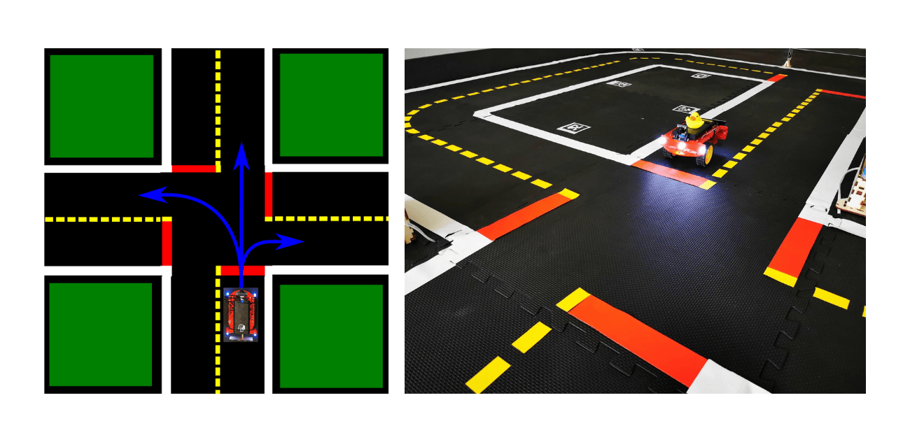
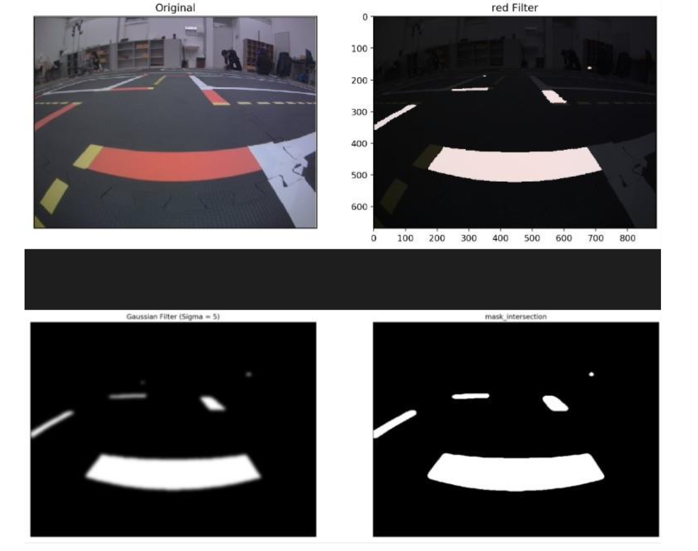
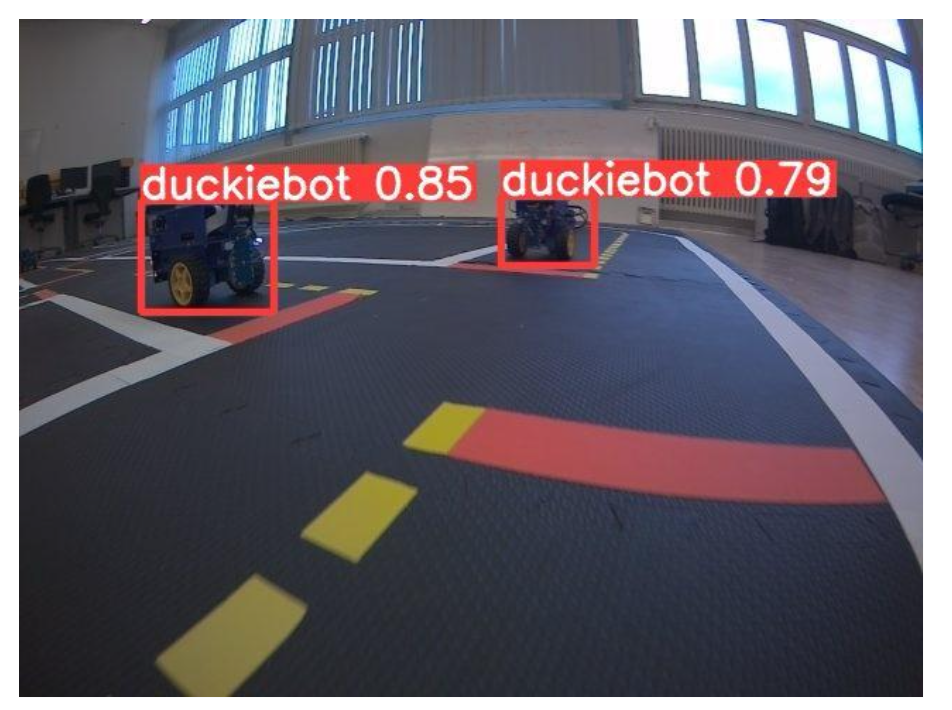
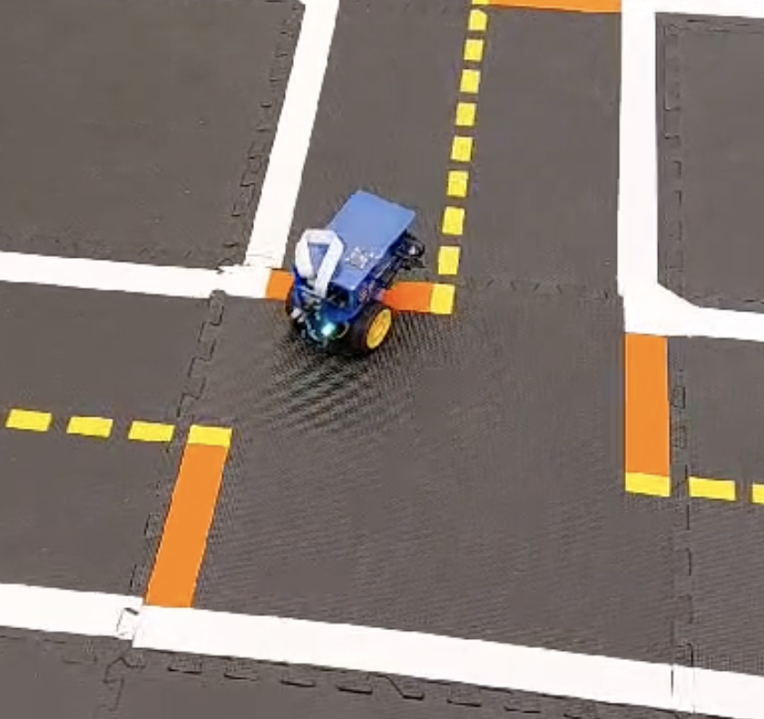
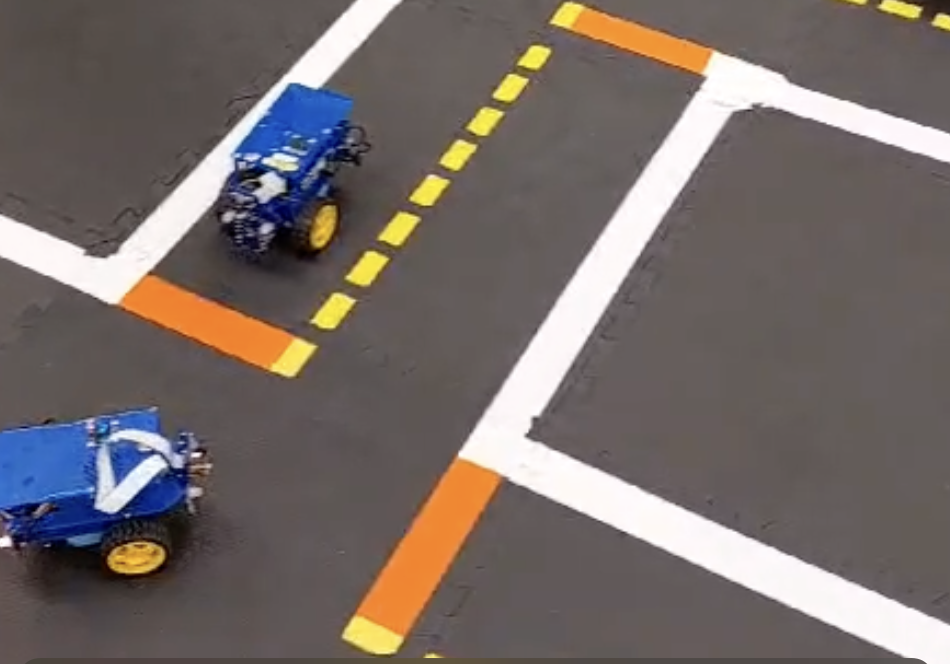
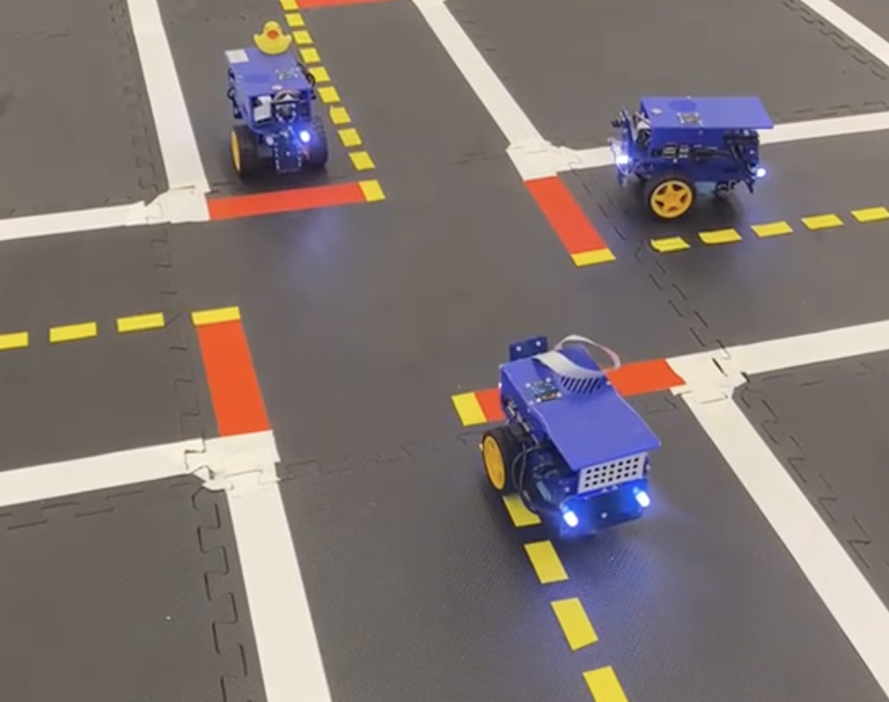

# Intersection Navigation for Duckietown
As part of the Duckietown class taught at ETH Zurich (Fall 2023), we worked on a small final project and presented it to other students as a group of three master students: Benjamin Dupont, Yanni Kechriotis, and Samuel Montorfani. We implemented an intersection navigation pipeline for the Duckiebots (small autonomous differential drive robots equipped with Nvidia Jetson Nano) to enable them to drive through intersections in the Duckietown road-like environment. 

The pipeline consists of:
1. **Perception**: Detect intersections and other Duckiebots in the environment.
2. **Decision Making**: Decide which way to go and whether it is safe to proceed based on the detections. This includes applying a decision-making stack to determine priority and right of way.
3. **Control**: Steer the Duckiebot through the intersection.

The pipeline is implemented in Python and uses the ROS framework to communicate with the Duckiebot and other nodes in the system.

## Project Overview

### Scope
- Detect intersections in Duckietown.
- Detect other Duckiebots in the intersection.
- Decide whether to stop, go, or turn based on other agents, using LED colors for communication.
- Navigate the intersection by turning left, right, or going straight, depending on the intersection options.
- Apply a decision-making stack to determine priority and right of way.

### Assumptions

All sensors on the Duckiebots are assumed to be fully functional. The intersections are expected to be of standard size, with standard markings that are clearly visible, and without any obstructions such as buildings. Additionally, the Duckiebots are assumed to be of standard size and shape. 
Finally, the code for the lane following is given by the instructors as it is part of the Duckietown software stack.

### Challenges

The project faces several challenges that could lead to failure. One major challenge is the presence of multiple Duckiebots at an intersection, which can create symmetry issues and complicate decision-making. Delayed decision-making can also pose a risk, as it may lead to collisions or traffic jams. The limited field of view of the Duckiebots can hinder their ability to detect other robots and obstacles in time. LED detection issues can further complicate communication between Duckiebots. Additionally, random component failures can disrupt the navigation process. To mitigate these risks, we implemented a robust priority system and strategies to improve field of view, such as detecting Duckiebots while approaching intersections and turning in place to get a better view. We also assume that there is always a Duckiebot on the left and make random decisions after a certain time to prevent deadlocks at intersections.

## Implementation details and results
The implementation of our intersection navigation project involved creating custom classes and functions to handle various tasks such as intersection detection, decision making, and control. The Duckiebot starts by following the lane and uses its camera to detect intersections by identifying red markers. Upon detecting an intersection, it stops and randomly chooses an action (straight, left, or right) based on the intersection type. The Duckiebot then signals its intended action using LEDs and checks for other Duckiebots at the intersection using a custom-trained YOLOv5 object detection model. This model provided reliable detection of other Duckiebots, which was crucial for the priority decision-making process. The Duckiebot follows standard traffic rules to determine right-of-way and uses motor encoders to execute the chosen action through the intersection. 

### Perception
The perception module is responsible for detecting intersections and other Duckiebots in the environment. We used the Duckietown lane following code to detect intersections based on the presence of red markers. The intersection detection algorithm was implemented using OpenCV to identify the red markers and determine the intersection type (T-intersection or 4-way intersection) and possible options for the duckiebot to navigate to. We also trained a custom YOLOv5 object detection model to detect other Duckiebots at the intersection. The model was trained on a dataset of Duckiebot images and achieved high accuracy in detecting Duckiebots in various orientations and lighting conditions. The alternative for this was to use the LEDs on the Duckiebots to communicate with each other, but we decided to use the object detection model for more reliable results, as the LED strength could vary depending on the lighting conditions, and on most robots, only one LED was working. We then ran the LED detection in the bounding box of the detected Duckiebots to determine the color of the LED and the direction the Duckiebot was going to take. This information was used in the decision-making module to determine the Duckiebot's next action. To determine in which position the other Duckiebots were, we used their bounding boxes in the camera pixel coordinates to infer their position relative to the Duckiebot. This information was used in the decision-making module to determine the Duckiebot's priority and right of way.

    
     
    <em>"+" Intersection detection</em>

    
     
    <em>YOLO v5 Detection</em>

### Decision Making
The decision-making module is responsible for determining the Duckiebot's next action based on the detected intersections and other Duckiebots. Once the different options were detected, the Duckiebot randomly chose an action (straight, left, or right) based on the intersection type.
We implemented a priority system to handle multiple Duckiebots at an intersection and ensure safe navigation. The priority system assigns right-of-way based on the Duckiebot's position relative to the other Duckiebots. The Duckiebot signals its intended action using LEDs to communicate with other Duckiebots and avoid collisions. This is used in complex cases where right of way is not sufficient. In the most simple case, the duckiebot just stays at a stop until the other duckiebot to the right has passed. In the case where the duckiebot is at a 4-way intersection, it will signal its intention to go straight, left, or right using the LEDs. If the duckiebot is at a T-intersection, it will signal its intention to go straight or turn using the LEDs. The decision-making module also includes a tie-breaking mechanism to resolve conflicts when multiple Duckiebots have the same priority. In these cases, the Duckiebot randomly chooses an action to prevent deadlocks and ensure smooth traffic flow. The decision-making module was implemented using a combination of if-else statements and priority rules to determine the Duckiebot's next action based on the detected intersections and other Duckiebots. The priority system was designed to handle various scenarios and ensure safe and efficient navigation through intersections. It was however not fully completed and tested during the project, as the time was limited.

### Control
Due to the limited time available for the project, we couldn't implement a full estimation and control pipeline for the Duckiebots. Instead, we decided to opt for a brute force approach by calculating the inputs needed to achieve the desired action using open loop control. This was sufficient in most cases, and the lane following module was able to take over just at the end of the intersection to compensate for potential small errors and go back on track.
Additionaly, to mitigate the effect of misalignment of the Duckiebot when approaching the intersection, we added a small alignment step before the intersection, where the Duckiebot would turn in place to get a better view of the intersection and align itself with the lanes. Using the intersection detection and aligning it with a template, we were able to ensure the duckiebot was straight when scanning the intersection, effectively improving the detection accuracy but also the intersection navigation itself thanks to a more standardized starting pose.

### Results
In terms of results, our systematic evaluation showed an intersection detection accuracy of approximately 90%, a turn completion rate of around 85%, and a Duckiebot detection accuracy of about 95%. However, we encountered some challenges, with crashes occurring about 10% of the time and off-road occurrences happening roughly 40% of the time, often due to camera delays, motor issues, or other hardware problems. These problems also arose due to the code running on our own laptops rather than the Duckiebot itself, which could have affected the real-time performance. Despite these challenges, our project demonstrated a successful implementation of intersection navigation for Duckiebots, and we received very positive feedback from our peers during the final presentation.

### Demonstration Videos

To see our intersection navigation system in action, watch the demonstration videos below:

#### Single Duckiebot

#### Two Duckiebots

#### Three Duckiebots

Click the images above to play the videos.

Note: As discussed in the challenges section, the videos show the Duckiebots running on our laptops rather than the actual Duckiebots, which could have affected the real-time performance. This affected the controls sent to the Duckiebots and the camera feed, leading to some crashes and off-road occurrences. 
Additionaly, the videos also show the sometime inaccurate lane following code, which was out of scope and given to us by the instructors, which was also an assumption made in the project.

## Conclusion and Future Work

In conclusion, our project successfully implemented an intersection navigation system for Duckiebots, achieving high accuracy in intersection detection and Duckiebot recognition. Despite hardware and software integration challenges, we demonstrated the feasibility of autonomous intersection navigation in Duckietown. The project met our initial goals, although the combined execution of actions revealed areas for improvement, particularly in handling delays and hardware reliability.

For future work, several extensions could enhance the Duckiebots' capabilities. Developing a more robust tie-breaking mechanism for four-way intersections and ensuring the system can handle non-compliant or emergency Duckiebots would improve reliability. Implementing traffic light-controlled intersections and enabling multiple Duckiebots to navigate intersections simultaneously with minimal constraints on traffic density would significantly advance the system's complexity and utility. Better integration of the code into the component framework would streamline development and debugging processes.

Achieving these improvements would require substantial effort, particularly in enhancing hardware reliability and refining the software framework. Despite the challenges, the potential advancements would unlock new skills for the Duckiebots, making them more versatile and capable in complex environments. Given the limited time we had for this project, we would have liked to have more time to work on these aspects as the schedule was quite tight.

Overall, we are satisfied with our project's outcomes and the learning experience it provided. The insights gained will inform future developments and contribute to the broader field of autonomous robotics.

## Design Document

The design document for the project can be found in the `/design_document` folder. It contains a pdf document exported from the word document that we filled in throughout our work, outlining the design choices, implementation details, and challenges faced during the project.